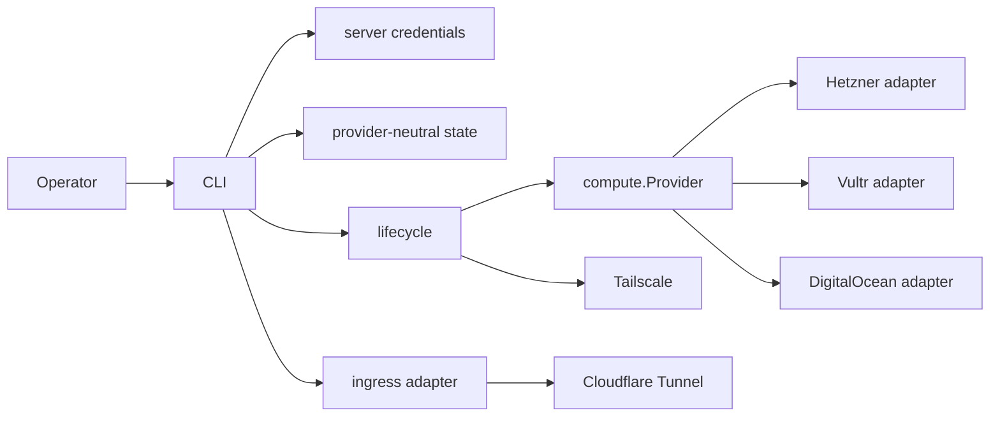

# Architecture

Date: 2026-07-22
Status: provider-agnostic implementation overview

## System overview

serverpro is a single-binary Go CLI for secure server provisioning and
operations. The core is provider-neutral: CLI and lifecycle code speak to
generic compute, credential, ingress, HTTP, state, and doctor abstractions.
Hetzner, Vultr, and DigitalOcean are the current compute provider adapters.
Cloudflare Tunnel is the first ingress adapter.

serverpro does not deploy applications, databases, process managers,
Kubernetes, Terraform, or app secrets. It prepares hardened hosts and safe
access paths for app-owned deployment flows.

## Canonical terminology

- Namespace: top-level serverpro resource group for local config, state, tags,
  names, and ownership metadata. It is independent from VPS, tunnel, and other
  providers.
- Server: logical server name inside a namespace.
- Provider: compute backend type, such as `hetzner`, `vultr`, or
  `digitalocean`.
- Server credential: private per-server token file containing compute-provider,
  Tailscale, and optional Cloudflare tokens for one server.
- Compute Provider facade: generic interface for catalog, create, status,
  power, and delete operations.
- Ingress: optional public exposure layer. Default is `none`.
- Adapter: provider-specific implementation behind a generic facade.
- Managed host tools: the host toolset serverpro converges on a target host
  (git, Docker, per-user mise, Node, Pi, Herdr), installed by the embedded
  bootstrap script. Herdr includes its target-user Pi lifecycle integration.
- Bootstrap target: named subset of managed host tools (`all`, `git`,
  `docker`, `mise`, `node`, `pi`) selected for a bootstrap run.

## Component map

- CLI: `internal/cli`
  - Resource-first Cobra commands, prompts, disambiguation, and output.
- Compute facade: `internal/compute`
  - Generic provider interface, registry, catalog, list, server, and in-memory
    token carrier types.
- Import recovery: `internal/importsync`
  - Discover labeled provider inventory and rebuild local config/state/registry.
- Credentials: `internal/credentials`
  - Private server-scoped credential files and validation.
- HTTP JSON helper: `internal/provider/httpjson`
  - Shared API client for auth, JSON, bounded response bodies, and status
    errors.
- Hetzner adapter: `internal/provider/hetzner`
  - Hetzner Cloud API mapping into generic compute operations.
- Vultr adapter: `internal/provider/vultr`
  - Vultr API mapping into generic compute operations.
- DigitalOcean adapter: `internal/provider/digitalocean`
  - DigitalOcean API mapping into generic compute operations.
- Ingress facade: `internal/ingress`
  - Generic route model, adapter registry, and Cloudflare Tunnel adapter.
- Tunnel installer: `internal/tunnel`
  - Cloudflared apt install script emitted for the Cloudflare Tunnel adapter.
- State: `internal/state`
  - Provider-neutral registry and per-server JSON state.
- Lifecycle: `internal/lifecycle`
  - Provision flow using generic compute and optional ingress.
- Cloud-init: `internal/cloudinit`
  - First-boot hardening user data.
- Bootstrap tools: `internal/bootstraptools`
  - Embedded per-target convergence script for the managed host tools with
    checksum-verified mise, digest-verified Herdr, and a GPG-pinned Docker key.
- Remote: `internal/remote`
  - Tailscale SSH execution with password-aware sudo.
- Doctor: `internal/doctor`
  - Validation and diagnostics.

## Dependency rules

- `cmd/serverpro` depends only on `internal/cli`.
- Generic packages must not import provider adapters.
- Provider adapters may import generic facades, shared HTTP helpers, and their
  own API types.
- CLI wires provider and ingress registries.
- Lifecycle talks to `compute.Provider`, not provider-specific clients, on
  resource-first paths.
- Ingress adapters are independent from compute providers.

## Runtime flow



### Create

1. Resolve namespace, server, and provider.
2. Require compatible provider catalog choices: location, size, and image.
3. Prompt for ingress; default `none`.
4. Validate server-scoped compute provider token and Tailscale access.
5. Checkpoint intended compute identity before creating external resources.
6. Resolve and checkpoint the canonical Tailscale tailnet identity, then
   checkpoint pending exact policy ownership before any update and confirm it
   only after the conditional policy write succeeds.
7. Create and checkpoint the optional tunnel and one-off access.
8. Render cloud-init with Tailscale-first bootstrap.
9. Create the compute server through `compute.Provider.Create`, checkpointing
   each recoverable provider resource. DigitalOcean and Vultr validate
   checkpointed firewall ownership and remove only exact legacy serverpro
   inbound UDP `3478` rules before retrying; Vultr also restores missing
   required UDP `41641` rules.
10. Wait for Tailscale SSH, converge managed host tools, and run doctor.

### Ingress

Ingress is optional and separate from compute. `internal/ingress` defines the
route model and registry. Cloudflare Tunnel routes do not require opening
inbound compute firewall ports.

## State architecture

Server state is local JSON under:

```text
~/.local/state/serverpro/namespaces/<namespace>/servers/<server>.json
```

Important fields:

- `compute`: provider, namespace, server, provider ID, location, size,
  image, public IP, and adapter state.
- `tailscale`: persisted tailnet selector and canonical tailnet ID, node
  identity, exact managed SSH policy tags and admin user, plus pending and
  confirmed policy ownership. Cleanup validates the live tailnet ID and remains
  bound to the original rule after config drift. The next live create or delete
  preflight reconciles an ambiguous write: exact full presence promotes pending
  ownership, full absence clears it, and partial application or drift remains
  blocked for manual repair. Dry-runs make no provider calls and cannot perform
  this reconciliation.
- `ingress`: generic ingress routes.
- `cloudflare`: Cloudflare tunnel metadata when present.

Provider-specific data stays inside provider-neutral state fields. Server state
and registry currently use schema version 1. Unversioned legacy files normalize
to version 1; unknown explicit versions fail before any write. Before `v1.0.0`,
mixed versions and downgrades are unsupported even when both binaries report
schema version 1: additive safety metadata can change, and an older binary can
discard fields it does not understand when rewriting state. Legacy state that
lacks required ownership identity fails before external mutation.

Current schema has no automatic migration. Any future schema bump must add
ordered migration and rollback tests, preserve a pre-migration backup, define
the compatible binary window, and update operator upgrade guidance in the same
change.

When local trees are missing, `server discover` / `server import` rebuild state
from live compute ownership labels (`managed-by`, `serverpro-namespace`,
`serverpro-server`) after the operator supplies API tokens. Recovery fails
closed when required compute metadata or a unique owned access policy cannot be
recovered. Optional enrichers reattach Tailscale devices and Cloudflare tunnels
by resource name.

## Security invariants

- Tailscale SSH is mandatory.
- Public SSH is disabled.
- Public app ingress defaults to `none`.
- Compute provider, location, size, and image are explicit operator choices.
- Provider ownership metadata uses `managed-by`, `serverpro-namespace`, and
  `serverpro-server` across Hetzner, Vultr, and DigitalOcean; flat tag values
  are reversibly encoded when provider character rules require it.
- Provider firewalls restrict inbound access; public SSH remains closed.
- Remote root actions require the admin sudo password.
- Provider and service tokens are stored in private server-scoped credential files.
- Runtime sudo passwords and bootstrap data are secrets and are never persisted.
- Delete and power operations use state-known IDs and identity checks.
- Retry creation on DigitalOcean and Vultr validates each checkpointed
  firewall, removes only exact legacy serverpro inbound UDP `3478` rules, and
  restores missing Vultr UDP `41641` rules before creating compute.
- Tailscale policy intent is durable before provider mutation and becomes
  confirmed ownership only after success. Live create and delete preflights
  reconcile wholly present or absent pending intent; partial application and
  policy drift fail closed.
- Before compute deletion, cleanup validates every tracked Tailscale and
  Cloudflare resource plus any shared-policy ownership transfer without
  provider mutation.

## Extension points

### Add a compute provider

1. Create `internal/provider/<name>`.
2. Implement `compute.Provider`.
3. Use `internal/provider/httpjson` for HTTP concerns.
4. Register the provider in CLI wiring.
5. Add adapter tests for catalog, create, status, power, delete, diagnostics,
   and redaction.

### Add ingress

1. Implement `ingress.Adapter`.
2. Register the adapter in CLI and lifecycle wiring.
3. Store generic `state.IngressState` entries.
4. Keep compute-provider firewall behavior separate.

## Architectural decisions

- Resource-first CLI with namespace root
  - Makes automation explicit while keeping a clear top-level grouping separate
    from provider resources and credentials.
- Server-scoped credentials
  - Avoids global secrets and ties every token file to the granular managed resource.
- Generic compute facade
  - Keeps CLI and lifecycle provider-agnostic and makes new providers small.
- Shared HTTP abstraction
  - Centralizes auth, JSON encode/decode, bounded response bodies, request
    deadlines, and typed status errors. Retries, pagination, and redaction are
    adapter-owned until shared support is implemented.
- Tailscale-first access
  - Avoids public SSH and gives a private admin path.
- Optional ingress
  - Public app exposure is explicit, auditable, and adapter-owned.
- Provider-neutral state
  - Enables future providers without leaking provider terms into core state.

## Quality requirements

- Unit tests use fake providers and adapters, not live APIs.
- Every new provider operation must include diagnostics and redaction tests.
- CLI output remains deterministic and JSON-stable.
- Docs and `WEB_SOURCES.md` must be updated when provider, ingress, or
  bootstrap tool behavior or versions change.
