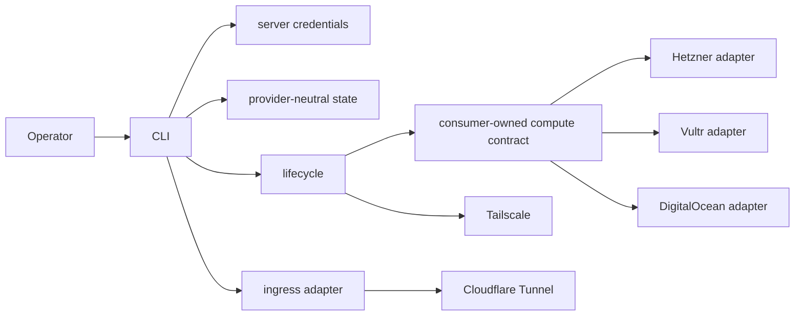

# Architecture

Date: 2026-09-01
Status: provider-agnostic implementation overview

## System overview

serverpro is a single-binary Go CLI for secure server provisioning and
operations. The core is provider-neutral: CLI and lifecycle code speak to
generic compute, credential, ingress, HTTP, state, and doctor abstractions.
Hetzner, Vultr, and DigitalOcean are the current compute provider adapters.
Cloudflare Tunnel is the first ingress adapter.

serverpro does not deploy applications, databases, process managers,
Kubernetes, Terraform, or app secrets. It prepares hardened hosts and safe
access paths for app-owned deployment flows.

## Canonical terminology

- Namespace: sole writable top-level serverpro identity for local config,
  credentials, state, registry, tags, names, and ownership metadata. Legacy
  `project` keys in config, credentials, state, and registry files are load-only
  migration input; canonical writes contain only `namespace`/`namespaces`. It is
  independent from VPS, tunnel, and other providers.
- Server: logical server name inside a namespace.
- Provider: compute backend type, such as `hetzner`, `vultr`, or
  `digitalocean`.
- Server credential: private per-server token file containing compute-provider,
  Tailscale, and optional Cloudflare tokens for one server.
- Compute Provider facade: complete registry-facing interface for doctor,
  catalog, inventory, create, status, power, and delete operations.
- Consumer compute contracts: import discovery owns a read-only `Name`/`List`
  boundary; lifecycle provisioning owns a `Name`/`Create` boundary. Registered
  provider adapters satisfy both without exposing unrelated operations.
- Ingress: optional public exposure layer. Default is `none`.
- Adapter: provider-specific implementation behind a generic facade.
- Supported runtime: macOS 27 arm64 for the controller and Ubuntu 24.04 LTS
  (`noble`) amd64/arm64 for managed hosts. Live create validates the selected
  provider catalog image before provider mutation; remote installers validate
  the actual host before managed mutation.
- Managed host tools: the host toolset serverpro converges on a target host
  (Tailscale, Git/OpenSSH, Docker/Compose, htop, per-user mise, Node/npm, Pi,
  uv, Rust, tmux, Herdr, gh, rg, fd, ast-grep, sem, inspect, and optional
  cloudflared), installed through checksum- or repository-verified update paths.
  Artifact tools use exact versions or reviewed minimums; directly installed apt
  packages use reviewed floors that accept newer security updates. Rust uses the
  default profile; Herdr includes its target-user Pi lifecycle integration.
- Bootstrap target: named subset of managed host tools (`all`, `git`,
  `docker`, `mise`, `node`, `pi`) selected for a bootstrap run. The `git`
  target includes Git/OpenSSH plus target-user mise and gh because interactive
  full-development setup requires all three before account mutation begins.
- GitHub development profile: the singular account-key model managed for one
  server: one global author identity, one account SSH key, one optional signing
  key, and one stored `gh` token. Fine-grained PATs cover one resource owner;
  serverpro does not route multiple GitHub usernames or PAT owner profiles.

## Component map

- CLI: `internal/cli`
  - Resource-first Cobra commands, prompts, disambiguation, and output.
- Compute facade: `internal/compute`
  - Generic provider interface, registry, catalog, server, typed managed-resource
    references, and in-memory token carrier types.
- Import recovery: `internal/importsync`
  - Discover labeled provider inventory and rebuild local config/state/registry.
- Credentials: `internal/credentials`
  - Private server-scoped credential files and validation.
- HTTP JSON helper: `internal/provider/httpjson`
  - Shared API client for auth, JSON, bounded response bodies, and typed status
    and body-limit errors.
- Hetzner adapter: `internal/provider/hetzner`
  - Hetzner Cloud API mapping into generic compute operations.
- Vultr adapter: `internal/provider/vultr`
  - Vultr API mapping into generic compute operations.
- DigitalOcean adapter: `internal/provider/digitalocean`
  - DigitalOcean API mapping into generic compute operations.
- Ingress facade: `internal/ingress`
  - Generic route model, adapter interface, and Cloudflare Tunnel route adapter.
- Tunnel installer: `internal/tunnel`
  - Ubuntu 24.04-gated cloudflared apt install script emitted for the Cloudflare
    Tunnel adapter. The downloaded repository key is fingerprint-verified before
    trust, the noble repository is explicit, and the installed package must meet
    the reviewed minimum.
- State: `internal/state`
  - Provider-neutral registry, per-server JSON state, and context-cancellable
    workflow lock ordering.
- Lifecycle: `internal/lifecycle`
  - Provision flow using generic compute and optional ingress.
- Host platform baseline: `internal/hostplatform`
  - Single authority for controller support, managed-host support, direct apt
    package floors, architecture sets, and shell manifests shared by cloud-init,
    bootstrap, Tailscale repair, ingress installation, doctor, and CLI choices.
- Cloud-init: `internal/cloudinit`
  - First-boot hardening user data with a defense-in-depth Ubuntu
    24.04/codename/architecture check, pre-install base-package candidate floors,
    post-install verification, and architecture-scoped checksum-verified
    Tailscale static binaries. Live provider image validation remains the
    authoritative pre-mutation host gate because cloud-init module failures do
    not globally cancel later modules.
- Tailscale tools: `internal/tailscaletools`
  - Shared Tailscale release manifest, exact client/daemon check, and
    checksum-verified live updater with delayed daemon restart.
- Bootstrap tools: `internal/bootstraptools`
  - Embedded per-target convergence script for the managed host tools. The
    shared host-platform manifest rejects unsupported hosts and renders every
    directly installed apt package with a reviewed minimum; apply preflights signed
    current candidates before package scripts can run, preserves newer packages,
    and verifies floors. The `all` target converges the complete base package set
    as well as the named tools. One
    Go-owned mise-tool specification renders version, backend, profile, and
    release-checksum settings, shell configuration/install rows, and doctor
    checks; readiness and final verification reuse one shell probe builder.
    Node/npm drift forces same-version Node replacement; `pi` and `all` then
    reinstall Pi because replacing Node can remove its global npm package.
    Existing active `sg` config migrates through mise's config-aware removal
    before the canonical `ast-grep` identity is configured. Inspect's bare
    release binary is hashed before execution because upstream
    exposes no version flag. The focused `git` path converges target-user mise
    and gh as account-access prerequisites. Pi and digest-verified Herdr retain
    purpose-built flows. mise downloads are checksum-verified and the Docker
    repository key is GPG-pinned.
- Remote: `internal/remote`
  - Tailscale SSH execution with password-aware sudo. Operation wrappers pass
    context deadlines to every runner; Tailscale adds its fallback only when
    the caller supplied no deadline. Read-only diagnostics use an explicit
    command plan and one framed, ordered batch with independent command status.
    Per-command, decoded-aggregate, and transport-output ceilings prevent remote
    output from growing local memory without bound.
- Doctor: `internal/doctor`
  - Validation and diagnostics; public-network probes are injected at the
    orchestration boundary and default to bounded TCP dialing in production.
    Each run reuses one compute, mesh, and explicit Cloudflare tunnel
    snapshot; a sudo prompt refreshes only remote inventory/checks instead of
    repeating providers.
    Batched diagnostics declare conditional reads before evaluation, replay
    baseline evidence strictly, and delegate only planned fixes and rechecks.
    Managed-package diagnostics verify package floors and use cached apt
    candidates without mutating; ingress-enabled diagnostics also verify the
    cloudflared floor and service. A first, blocking platform check disables
    every requested fix when the actual OS, codename, or architecture is outside
    support. `--fix` refreshes repositories, upgrades the
    general managed package set, repairs exact tool pins, and stages Tailscale
    before restarting its daemon after the SSH update command returns.
- Polling: `internal/poll`
  - Shared context-aware wait policy used by provider and lifecycle polling.
- Mesh facade: `internal/mesh`
  - Provider-neutral device/auth-key/policy types and canonical identity matching.
- Tailscale adapter: `internal/provider/tailscale`
  - Mesh API operations and explicit tailnet-global policy reconciliation.
- Provider utilities: `internal/provider/providerutil`
  - Shared mutation-provider validation and secret-safe diagnostic construction.
- Hermetic composition: `cmd/serverpro-e2e`, `internal/e2e`
  - Build-tagged CLI wiring injects only loopback provider and low-level
    mesh/remote/probe clients. Production doctor and cleanup orchestration
    remain intact while deterministic time/checkpoint fakes and a fake
    Tailscale executable keep concurrent provider journeys hermetic. Production
    builds exclude this composition root.

## Dependency rules

- `cmd/serverpro` depends only on `internal/cli`.
- Generic packages must not import compute, Tailscale, or Cloudflare adapters.
  Only `internal/cli/provider_registry.go`, build-tagged
  `internal/cli/e2e_provider_registry.go`, and `internal/cli/services.go` may
  import them as explicit composition roots.
- Provider adapters may import generic facades, shared HTTP helpers, and their
  own API types.
- CLI wires provider and ingress registries.
- Lifecycle accepts its consumer-owned `ComputeCreator` contract, not a full
  provider facade or provider-specific client. Import recovery similarly owns
  its read-only discovery contract.
- Ingress adapters are independent from compute providers.

## Runtime support contract

`internal/hostplatform` owns the runtime matrix and package floors used by code.
Documentation mirrors that source; it does not independently define executable
values. The controller support target is macOS 27 arm64. Managed-host support is
Ubuntu 24.04 LTS (`noble`) on amd64 or arm64. Provider image IDs remain explicit
operator input because catalogs use incompatible identifiers. Live create
refetches the selected location's catalog and rejects a missing or unsupported
image before any provider mutation; explicit input does not widen support.

Artifact releases are exact except mise, which is a minimum compatible release.
Direct apt packages are minimums rather than exact locks: installs use the
current signed candidate, reject candidates below the reviewed floor, retain
newer installed versions, and permit future security upgrades. Doctor reports
both below-floor state and cached newer candidates. Tailscale remains an exact
client/daemon release; cloudflared is a minimum ingress package and is diagnosed
separately from generic bootstrap repair.

## Runtime flow



### Create

1. Resolve namespace, server, and provider.
2. Require explicit provider catalog choices: location, size, and image.
3. Prompt for ingress; default `none`.
4. Validate the compute provider token, refetch the selected location's catalog,
   reject a missing or unsupported image before provider mutation, and validate
   Tailscale access. Long create stages emit fixed-vocabulary phase, elapsed-time, and attempt events
   to stderr while stdout remains the final JSON report.
5. Ensure the shared Tailscale policy and checkpoint its tracked changes.
6. Before creating a Cloudflare tunnel, adopt the one exact account-wide name
   match; reject duplicate-name ambiguity. Checkpoint tunnel identity with
   `created` or `adopted` provenance, and compensate only a fresh tunnel when
   publication fails.
7. Create and checkpoint the one-off Tailscale auth key, then render cloud-init
   with the shared pinned, checksum-verified Tailscale-first bootstrap.
8. Create compute through the lifecycle-owned `ComputeCreator.Create` boundary,
   then wait for and checkpoint its Tailscale device. Every mutation failure
   returns a typed lifecycle phase plus non-secret resource IDs, including IDs
   whose checkpoint failed.
9. Wait for Tailscale SSH and converge the managed host tools through the
   embedded bootstrap script.
10. During interactive GitHub setup, persist the selected non-secret access
    intent before remote mutation. Full development requires a PAT; deploy-key
    intent includes its normalized repository scope. Switching from deploy-key
    to account-key removes the managed repository rewrite and SSH block before
    clearing that transitional scope.
11. Run doctor with the reloaded intent, including exact configured Git identity
    and signing checks for account-key access.

### Delete and tailnet policy

After approval and locked authority revalidation, server deletion reads and
checks each tracked external resource before compute mutation. An API or
ownership error stops before compute deletion. External cleanup repeats the
same ownership checks immediately before each DELETE.

Independent providers do not supply one atomic transaction. If the compute
provider reports successful deletion but external cleanup fails, the CLI returns
a typed partial failure. It writes structured recovery evidence and exits
nonzero. It retains local state and registry authority. A retry rechecks current
resources and treats absent compute
resources as completed cleanup.

Server deletion owns only server-scoped compute, Tailscale device/auth-key, and
Cloudflare tunnels proven `created` by serverpro. Adopted, imported, and legacy
unknown-provenance tunnels remain external. DigitalOcean validates the tracked
Droplet and firewall before its first provider mutation. Historical firewalls
using broad ownership-tag selectors are deletion-compatible only when their
name and complete selector set match state, they have no direct attachments,
and live inventory proves no unrelated Droplet matches any selector. It never
edits tailnet-global ACL policy. The explicit `tailnet reconcile` operation
requires a stable tailnet identity, serializes with create/import for that
tailnet, and combines matching
readable registered state with live device tags. Token-relative (`-`) or missing
state identity fails closed when policy evidence exists. Reconciliation removes
only exact serverpro tag-owner shapes and stale destinations from recognized SSH
rules. Tags referenced as owners by retained definitions remain policy
dependencies and cannot be removed. Destination rewrites preserve unmodeled
SSH-rule fields so future API fields survive reconciliation. Apply refetches policy and devices, aborts unless
the removal plan still exactly matches the approved preview, validates the
edited document, and posts with its ETag. A missing ETag aborts every policy
mutation before publication.
Interactive previews go to stderr so stdout contains one final JSON document.

### Ingress

Ingress is optional and separate from compute. `internal/ingress` defines the
route model and adapter interface; the `internal/cli` composition root owns the
adapter registry. Cloudflare Tunnel routes do not require opening inbound
compute firewall ports.

## State architecture

Server state is local JSON under:

```text
~/.local/state/serverpro/namespaces/<namespace>/servers/<server>.json
```

Important fields:

- `compute`: provider, namespace, server, provider ID, location, size,
  image, public IP, and adapter state.
- `tailscale`: stable tailnet identity, Tailscale node identity, and policy markers.
- `ingress`: generic ingress routes.
- `cloudflare`: Cloudflare tunnel metadata plus `created`, `adopted`, or
  `imported` provenance when present. Missing legacy provenance fails closed
  for deletion.

Registry internals group entries by `namespaces`; legacy registry `projects`
objects are decoded only at the file boundary and normalized from their outer
namespace key. Mixed canonical and legacy registries union distinct servers but
fail closed when both schemas claim the same server with different authority.
Managed access policies have one typed provider-neutral authority. Legacy
adapter-map keys migrate only at read boundaries, matching typed/legacy values
coalesce, conflicts fail closed, and canonical writes remove every legacy key.
Unrelated provider-specific data stays inside opaque provider state fields.
Per-server state mutations use adjacent advisory locks
and read-modify-write updates so concurrent status, ingress, and cleanup
checkpoints preserve one another. Longer operations use context-cancellable,
nonblocking advisory-lock retries. `internal/state.LockServerWorkflow` owns the
canonical shared-namespace then exclusive-server acquisition order and reverse
release for create, import, and single-server delete. Namespace create/delete
acquire the namespace lock exclusively; recursive delete then acquires only
server locks because it already owns the namespace. Namespace delete inventories
canonical config, credentials, state,
and import-marker paths before approval, rejects any unregistered local authority,
then reloads registry plus parsed state or missing-state status under the
exclusive lock before provider or local cleanup.
Create parses the exact snapshotted source bytes, then conditionally publishes
under a config-file lock so managed-target normalization and competing managed
writers cannot replace approved input. Other config read-modify-write operations
read and publish under that same lock. Delete requires the current registry entry
to route the supplied state path before locking, then revalidates locked state,
registry routing, cleanup configuration, and credential authority before
provider mutation; cleanup keeps the validated state path instead of
re-resolving it. Create and import additionally coordinate registry publication
with tailnet reconciliation through a per-tailnet advisory lock. Stable identities
share a global read guard plus their own lock; token-relative identity takes the
global guard exclusively because it may resolve to any tailnet.
Config, state, registry, and credential publication
syncs file contents and the parent directory
before reporting success. Provision failures preserve their original wrapped
cause and snapshot known Cloudflare, Tailscale, compute, and provider access-policy
IDs so retries and deletion can reconcile partial creates. Before resumed compute
creation, every adapter refetches checkpointed access policy and validates provider
identity, ownership, effective rules or selectors, and attachment scope. Vultr may
add missing required rules, but foreign or broadened rules and attachments fail
closed; Hetzner and DigitalOcean require their exact approved policy shape.

When local trees are missing, `server discover` / `server import` rebuild state
from live compute ownership labels (`managed-by`, `serverpro-namespace`,
`serverpro-server`) after the operator supplies API tokens. Provider inventory
also recovers the typed managed access-policy identity: Vultr uses the attached
firewall-group ID, while Hetzner requires one exact owned
`<server-name>-deny-public` firewall match. DigitalOcean requires that exact name,
one namespace/server-derived target tag, and no direct droplet-ID attachments.
Historical firewalls using the complete legacy ownership-tag selector set are
recoverable only when full live Droplet inventory proves no unrelated match.
Missing, ambiguous, or otherwise broadened policy matches fail closed rather
than publishing deletion-incomplete state. Import writes a
non-secret transaction marker before config, credentials, state, and registry;
it removes the marker only after registry publication. A matching retry resumes
without `--force`, and discovery reports state without registry as `partial`.
Optional enrichers reattach Tailscale devices and Cloudflare tunnels by resource
name. Provider-only recovery retains mandatory mesh intent and may publish a
private incomplete credential set for later interactive completion. Forced
import repairs the disabled-Tailscale config emitted by earlier releases and
merges omitted service tokens from existing credentials instead of erasing
them. Forced import of an existing entry uses valid local config/state as its
baseline: live compute and explicit enrichment fields replace recoverable
identity, while operator config, Tailscale policy evidence, ingress checkpoints,
and creation time survive. Same-tunnel stronger Cloudflare provenance survives;
provenance never transfers to a different tunnel. Config publication compares
the exact loaded source and rejects concurrent appearance or edits. Matching
transaction retries reload that preserved baseline instead of rebuilding
defaults. Only an explicit not-found result counts as missing state; permission,
invalid-path, malformed, and other
filesystem errors abort provision/import instead of bypassing or replacing
existing authority. SSH admin-user recovery likewise creates a minimal config
only when the config file is absent; malformed or unreadable operator config is
never replaced.

## Security invariants

- Tailscale SSH is mandatory.
- Public SSH is disabled.
- Public app ingress defaults to `none`.
- Omitted post-bootstrap egress-lockdown configuration defaults to enabled;
  disabling it requires an explicit `false`. Restricted egress permits
  outbound SSH (22/tcp) so git-over-SSH keeps working; doctor detects and
  repairs pre-existing hosts missing the rule.
- GitHub access levels are explicit operator choices: `none`, read-only
  `deploy-key`, or full-development `account-key`. Full development requires a
  PAT. Secrets (PAT, private keys) never persist in config or state; the
  non-secret `git` section records exact identity, signing, access, and deploy
  repository scope needed for diagnosis and safe access-mode reconciliation.
- Compute provider, location, size, and image are explicit operator choices.
- Provider ownership metadata uses `managed-by`, `serverpro-namespace`, and
  `serverpro-server` across Hetzner, Vultr, and DigitalOcean; flat tag values
  are reversibly encoded when provider character rules require it. A
  DigitalOcean firewall targets only its droplet through one derived
  namespace/server tag and rejects direct droplet-ID attachments. Deletion
  preflights the complete tracked provider graph; exact historical broad
  selectors require a zero-unrelated-match live inventory before cleanup.
- Provider firewalls restrict inbound access; public SSH remains closed.
- Remote root actions require the admin sudo password.
- Provider and service tokens are stored in private server-scoped credential files.
- Provider authentication tokens are excluded from JSON serialization even
  when request DTOs are marshaled; account names/scopes remain serializable.
- Redacted error messages preserve their wrapped cause so cancellation,
  sentinel, and typed error handling remain reliable without exposing secrets.
- Runtime sudo passwords and bootstrap data are secrets and are never persisted.
- Lifecycle progress uses fixed phase names only; tokens, passwords, hashes,
  bootstrap data, and target identifiers never enter progress events.
- Delete and power operations use state-known IDs and identity checks.
- Per-server delete never mutates tailnet-global ACL policy; explicit
  reconciliation requires stable matching-tailnet state, live-device absence,
  and an unchanged approved removal plan.

## Extension points

### Add a compute provider

1. Create `internal/provider/<name>`.
2. Implement `compute.Provider`.
3. Use `internal/provider/httpjson` for HTTP concerns.
4. Register the provider in CLI wiring.
5. Add adapter tests for catalog, create, status, power, delete, diagnostics,
   and redaction.

### Add ingress

1. Implement `ingress.Adapter`.
2. Register the adapter in CLI and lifecycle wiring.
3. Store generic `state.IngressState` entries.
4. Keep compute-provider firewall behavior separate.

## Architectural decisions

- Resource-first CLI with namespace root
  - Makes automation explicit while keeping a clear top-level grouping separate
    from provider resources and credentials.
- Server-scoped credentials
  - Avoids global secrets and ties every token file to the granular managed resource.
- Generic compute facade
  - Keeps CLI and lifecycle provider-agnostic and makes new providers small.
- Shared HTTP abstraction
  - Centralizes auth, JSON encode/decode, bounded response bodies, request
    deadlines, and typed status/body-limit errors. Retries, pagination, and
    redaction are adapter-owned until shared support is implemented.
- Tailscale-first access
  - Avoids public SSH and gives a private admin path.
- Optional ingress
  - Public app exposure is explicit, auditable, and adapter-owned.
- Provider-neutral state
  - Enables future providers without leaking provider terms into core state.

## Quality requirements

- Unit tests use fake providers and adapters, not live APIs.
- Polling tests inject wait policies instead of sleeping or mutating package
  timeouts; HTTP fixture handlers record failures for assertion by the owning
  test goroutine.
- Every new provider operation must include diagnostics and redaction tests.
- CLI stdout remains deterministic and JSON-stable; create/bootstrap progress
  is fixed-vocabulary, secret-safe, and stderr-only.
- Concurrent full-chain provider journeys run production doctor and cleanup
  orchestration in a distinct non-live CI job; failure artifacts redact test
  credentials and contain no provider secrets.
- `TESTING.md` must list command, package, use-case, and dogfood coverage for
  each new or changed capability.
- Docs and `WEB_SOURCES.md` must be updated when provider, ingress, or
  bootstrap tool behavior or versions change.
